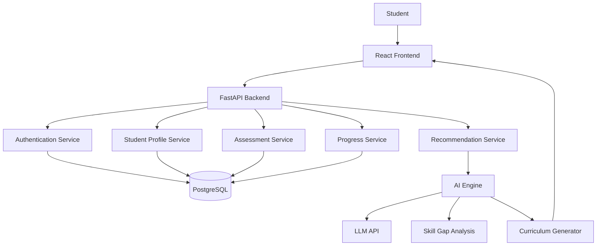
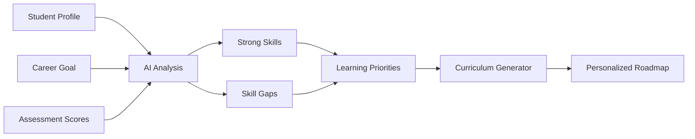
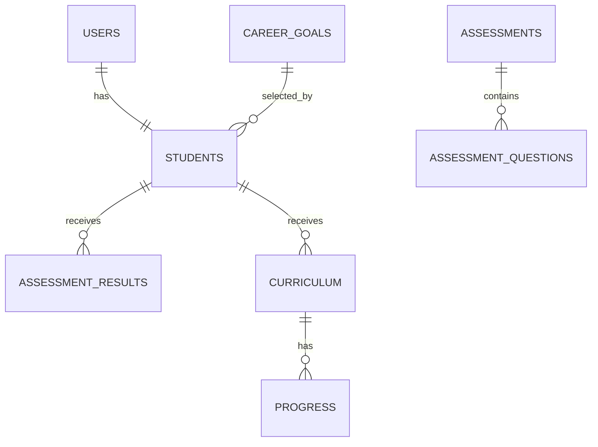

# AI-Driven Dynamic Curriculum Recommendation Engine

> **Domain:** Generative AI & AI Agents  
> **Project Type:** Academic / Educational AI Project  
> **Development Approach:** Incremental Version-Based Development  
> **Current Target:** Version 1 (MVP)

## 1. 1. Project Overview

The **AI-Driven Dynamic Curriculum Recommendation Engine** is an intelligent learning platform designed to generate personalized learning paths for students based on their current skills, career goals, assessment performance, and learning progress.

Traditional learning platforms often provide the same course sequence to many learners. Students, however, begin with different knowledge levels, strengths, weaknesses, interests, and career objectives.

This project uses **Generative AI** to analyze a student's profile and skill gaps and generate a personalized curriculum.

The long-term vision is to evolve the platform into an **AI-powered adaptive learning system** with an AI tutor, Retrieval-Augmented Generation (RAG), career guidance, and multiple collaborating AI agents.

---

## 2. 2. Problem Statement

Students often struggle to identify:

- What they already know
- Which skills they are missing
- What they should learn next
- In what order they should learn topics
- Which resources suit their current level
- How their learning path should change as their skills improve

Most conventional learning systems follow predefined course structures and do not dynamically generate a curriculum for each individual learner.

Therefore, there is a need for an intelligent system that can analyze student-specific information and generate a **personalized, skill-gap-driven, career-oriented learning roadmap**.

---

## 3. 3. Proposed Solution

The system collects:

- Student profile
- Career goal
- Existing skills
- Skill levels
- Assessment scores
- Learning progress

It then identifies skill gaps and uses Generative AI to generate:

- Missing skills
- Learning priorities
- Recommended topics
- Learning sequence
- Weekly curriculum
- Learning resources

The student's progress can later be used to dynamically modify the curriculum.

---

## 4. 4. Project Vision

The project is developed incrementally:

```text
Version 1
Basic Personalized Curriculum
        ↓
Version 2
Adaptive / Dynamic Curriculum
        ↓
Version 3
AI Tutor + RAG
        ↓
Version 4
Career Coach + Interview Preparation
        ↓
Version 5
Multi-Agent AI Learning Platform
```

---

## 5. 5. Version Roadmap

| Version | Main Features | Goal |
|---|---|---|
| **V1** | Profile, Career Goal, Assessment, Skill Gap, AI Curriculum, Roadmap, Progress | Working personalized curriculum engine |
| **V2** | Adaptive curriculum, AI quizzes, weekly reports, notifications | Make curriculum dynamic |
| **V3** | AI Tutor, RAG, PDF analysis, flashcards | Conversational learning assistant |
| **V4** | Resume analysis, interview preparation, coding challenges, career coach | Career readiness |
| **V5** | Multi-agent architecture, voice assistant, analytics, placement readiness | Full AI learning ecosystem |

---

## 6. 6. Version 1 Scope

### 6.1 User Authentication

- Register
- Login
- Logout
- Protected student area

### 6.2 Student Profile

- Name
- Education information
- Existing skills
- Skill levels
- Learning preferences

### 6.3 Career Goal

Initial examples:

- AI Engineer
- Data Scientist
- Data Analyst
- Full Stack Developer
- Cloud Engineer

### 6.4 Skill Assessment

The student takes an assessment designed to evaluate selected skills.

Example:

```text
Python        → 80%
SQL           → 60%
ML            → 40%
Deep Learning → 20%
```

### 6.5 Skill Gap Analysis

```text
Student Skills
       +
Assessment Results
       +
Career Skill Requirements
       ↓
Skill Gap
```

### 6.6 AI Curriculum Generation

Example:

```text
Week 1 - Python for AI
Week 2 - NumPy and Pandas
Week 3 - Machine Learning Fundamentals
Week 4 - Deep Learning
Week 5 - NLP
Week 6 - LLMs
```

### 6.7 Learning Roadmap

The generated curriculum is presented as a visual roadmap.

### 6.8 Resource Recommendation

Version 1 may use curated/static resources. Later versions can introduce dynamic resource retrieval.

### 6.9 Progress Tracking

Students can mark topics as:

- Not Started
- In Progress
- Completed

---

## 7. 7. User Workflow

```text
                    STUDENT
                       |
                       v
                 Registration
                       |
                       v
                     Login
                       |
                       v
               Student Profile
                       |
                       v
                Career Goal
                       |
                       v
              Skill Assessment
                       |
                       v
              Assessment Result
                       |
                       v
              Skill Gap Analysis
                       |
                       v
             Generative AI Engine
                       |
                       v
           Personalized Curriculum
                       |
                       v
              Learning Roadmap
                       |
                       v
             Learning Resources
                       |
                       v
              Progress Tracking
```

---

## 8. 8. High-Level System Architecture



---

## 9. 9. AI Workflow



---

## 10. 10. Example AI Prompt

```text
You are an AI curriculum advisor.

Analyze the following student.

Career Goal:
AI Engineer

Current Skills:
Python - Intermediate
SQL - Beginner
Machine Learning - Beginner
Deep Learning - Beginner

Assessment Scores:
Python - 80%
SQL - 45%
Machine Learning - 30%
Deep Learning - 20%

Identify:
1. Strong skills
2. Weak skills
3. Skill gaps
4. Learning priorities
5. Recommended learning sequence
6. Personalized weekly curriculum
```

Prefer structured output so the application can reliably consume AI results.

Example:

```json
{
  "career": "AI Engineer",
  "strong_skills": ["Python"],
  "skill_gaps": ["Machine Learning", "Deep Learning", "NLP", "LLMs"],
  "learning_priorities": [
    "Machine Learning Fundamentals",
    "Deep Learning Fundamentals",
    "NLP",
    "Large Language Models"
  ],
  "roadmap": [
    {"week": 1, "topic": "Machine Learning Fundamentals"},
    {"week": 2, "topic": "Deep Learning"},
    {"week": 3, "topic": "NLP"},
    {"week": 4, "topic": "LLMs"}
  ]
}
```

---

## 11. 11. Technology Stack

### Frontend

| Technology | Purpose |
|---|---|
| React | User interface |
| TypeScript | Type-safe frontend |
| Tailwind CSS | UI styling |
| React Router | Navigation |

### Backend

| Technology | Purpose |
|---|---|
| Python | Backend and AI integration |
| FastAPI | REST API |
| Pydantic | Validation |
| SQLAlchemy | ORM |

### Database

| Technology | Purpose |
|---|---|
| PostgreSQL | Relational database |

### AI

| Technology | Purpose |
|---|---|
| Gemini API / OpenAI API | LLM integration |
| Python | AI services |

### Future AI Technologies

| Technology | Planned Purpose |
|---|---|
| LangChain | LLM application framework |
| LangGraph | Agent workflows |
| RAG | Knowledge-grounded responses |
| ChromaDB / FAISS | Vector search |
| AI Agents | Autonomous learning workflows |

### Development / Deployment

| Technology | Purpose |
|---|---|
| Git | Version control |
| GitHub | Collaboration |
| Docker | Containerization |
| GitHub Actions | CI/CD |
| Vercel / Render / similar | Deployment |

---

## 12. 12. Why These Technologies?

**React:** reusable interactive UI components.

**FastAPI:** lightweight Python API framework suitable for AI-backed services.

**PostgreSQL:** structured storage for users, assessments, curriculum, and progress.

**Generative AI:** personalized curriculum generation instead of only hard-coded recommendations.

**GitHub:** version control, collaboration, code review, and project management.

---

## 13. 13. Database Design

Initial entities:

```text
users
students
skills
career_goals
assessments
assessment_questions
assessment_results
curriculum
progress
```

Relationships:



---

## 14. 14. Project Development Roadmap

| Phase | Main Project Work |
|---|---|
| **Phase 1** | Requirements, literature survey, system design |
| **Phase 2** | Backend, database, frontend foundation |
| **Phase 3** | Student profile, career goals, skill assessment |
| **Phase 4** | Skill-gap analysis and AI integration |
| **Phase 5** | Personalized curriculum and roadmap |
| **Phase 6** | Progress tracking and testing |
| **Phase 7** | Version 1 completion |
| **Phase 8** | Adaptive curriculum and advanced AI features |

## 15. 21. Version 2 – Adaptive Learning

Planned features:

- AI-generated quizzes
- Difficulty adjustment
- Progress analysis
- Weekly AI reports
- Dynamic curriculum updates
- Smart notifications

Example:

```text
Student studies topic
        ↓
Takes quiz
        ↓
Low score
        ↓
AI identifies weakness
        ↓
Extra practice added
        ↓
Curriculum updated
```

---

## 16. 22. Version 3 – AI Tutor + RAG

Planned features:

- AI chat tutor
- PDF/document upload
- Notes summarization
- Question answering
- Flashcards
- RAG
- Vector database

Future workflow:

```text
Student Question
       ↓
AI Tutor
       ↓
Retriever
       ↓
Vector Database
       ↓
Relevant Knowledge
       ↓
LLM
       ↓
Answer
```

---

## 17. 23. Version 4 – AI Career Coach

Planned features:

- Resume analysis
- Missing skill identification
- Interview preparation
- Mock interviews
- Coding challenges
- Career recommendations
- Company-specific learning paths

```text
Resume
  ↓
AI Analysis
  ↓
Current Skills
  ↓
Missing Skills
  ↓
Personalized Curriculum
  ↓
Interview Preparation
```

---

## 18. 24. Version 5 – Multi-Agent Learning Platform

Potential agents:

```text
Skill Assessment Agent
        ↓
Curriculum Agent
        ↓
Resource Recommendation Agent
        ↓
Progress Monitoring Agent
        ↓
AI Tutor Agent
        ↓
Career Coach Agent
        ↓
Interview Agent
```

A future orchestrator can coordinate these agents.

---

## 19. 25. Security

- Never store plain-text passwords.
- Use password hashing.
- Store API keys in environment variables.
- Never commit `.env` files containing secrets.
- Validate API input.
- Protect authenticated endpoints.
- Use HTTPS in production.
- Apply authorization rules.
- Validate uploaded files in future versions.

Example `.env.example`:

```env
DATABASE_URL=
SECRET_KEY=
AI_API_KEY=
```

---

## 20. 26. Testing Strategy

### Backend

Test:

- Registration
- Login
- Profile APIs
- Assessment APIs
- Curriculum APIs

### Frontend

Test:

- Form validation
- Navigation
- Assessment interaction
- Dashboard rendering
- API error handling

### AI

Evaluate:

- Skill-gap accuracy
- Curriculum relevance
- Consistency
- Personalization
- Structured output validity

### Integration

Test:

```text
Register
→ Login
→ Profile
→ Career
→ Assessment
→ Results
→ AI Recommendation
→ Roadmap
→ Progress
```

---

## 21. 27. Personalization Test Cases

### Student A

```text
Python: 90%
SQL: 75%
ML: 30%
DL: 20%
```

Expected focus:

```text
Machine Learning
Deep Learning
NLP
LLMs
```

### Student B

```text
Python: 40%
SQL: 30%
ML: 20%
DL: 10%
```

Expected focus:

```text
Python Fundamentals
SQL
Statistics
Machine Learning Basics
```

### Student C

```text
Python: 90%
SQL: 90%
ML: 85%
DL: 80%
```

Expected focus:

```text
Advanced ML
LLMs
RAG
MLOps
Advanced AI Systems
```

The important objective is to demonstrate that students with different skill profiles can receive different recommendations for the same career goal.

---


## 22. 31. Version 1 Final Demonstration

The final V1 demo should show:

```text
1. Student Registration
        ↓
2. Login
        ↓
3. Student Profile
        ↓
4. Career Goal Selection
        ↓
5. Skill Assessment
        ↓
6. Assessment Result
        ↓
7. Skill Gap Analysis
        ↓
8. AI Curriculum Generation
        ↓
9. Personalized Roadmap
        ↓
10. Progress Tracking
```

The key demonstration is:

> **Two students with different skill profiles should be able to receive different learning recommendations for the same career goal.**

---

## 23. 32. Expected Version 1 Deliverables

- Working web application
- React frontend
- FastAPI backend
- PostgreSQL database
- Authentication
- Student profile
- Career goal module
- Skill assessment
- Skill-gap analysis
- LLM integration
- Personalized curriculum generator
- Learning roadmap
- Resource recommendation
- Progress tracking
- API documentation
- Database documentation
- Testing documentation
- GitHub repository
- Project documentation
- Final presentation
- Project demonstration

---


## 24. 36. Future Scope

The platform can eventually include:

- Dynamic curriculum adaptation
- Personalized quizzes
- AI tutoring
- RAG-based question answering
- PDF learning-material analysis
- Voice learning assistant
- Resume analysis
- Career coaching
- Interview simulation
- Coding assessment
- Job-oriented curriculum
- Learning analytics
- Placement readiness score
- Faculty dashboard
- Multi-agent collaboration

---

## 25. 37. Conclusion

The **AI-Driven Dynamic Curriculum Recommendation Engine** aims to move beyond static learning paths by using Generative AI to understand individual learners and create personalized career-oriented curricula.

The project is intentionally developed in versions.

```text
Student
  ↓
Assessment
  ↓
Skill Gap
  ↓
Generative AI
  ↓
Personalized Curriculum
  ↓
Roadmap
  ↓
Progress
```

Future versions will introduce adaptive learning, RAG, AI tutoring, career coaching, and multi-agent AI systems.

The long-term goal is to create an intelligent learning ecosystem where the curriculum continuously evolves with the learner.

---
